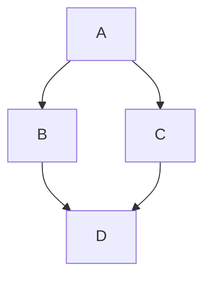

# Around Design Patterns

| Mediator  | Observer |
| :-----------: |:-------------:|
| left foo      | right foo     |
| left bar      | right bar     |
| left baz      | right baz     |

<table>
  
  <tr>
    <th align="center">Mediator</th>
    <th align="center">Observer</th>
  </tr>
  <tr>
    <td align="center">
        
    </td>
    <td align="center">
        <!--
        </img>
        -->
    </td>
  </tr>
  </table>
## Mermaid diagrams

