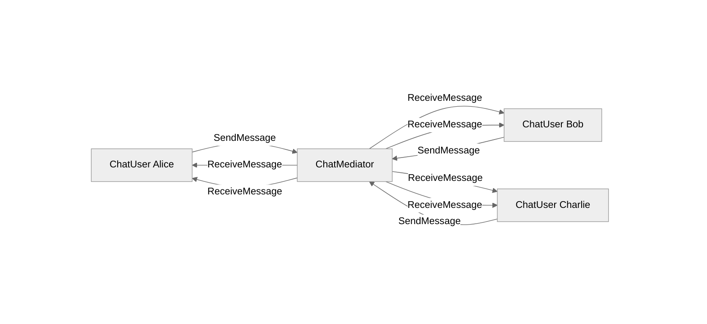

# Mediator Design Pattern
Define an object that encapsulates how a set of objects interact. 
Mediator promotes loose coupling by keeping objects from referring to each other
explicitly, and it lets you vary their interaction independently.

