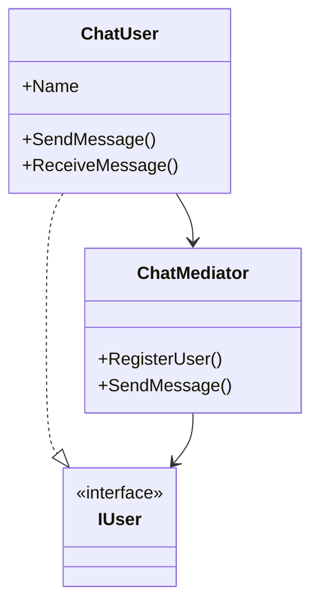

# Mediator Design Pattern

 

```mermaid
 classDiagram
    class ChatMediator {
        +RegisterUser()
        +SendMessage()
    }

    class ChatUser {
        +Name
        +SendMessage()
        +ReceiveMessage()
    }

    class IUser {
        <<interface>>
    }

    ChatUser ..|> IUser
    ChatUser --> ChatMediator
    ChatMediator --> IUser
```
