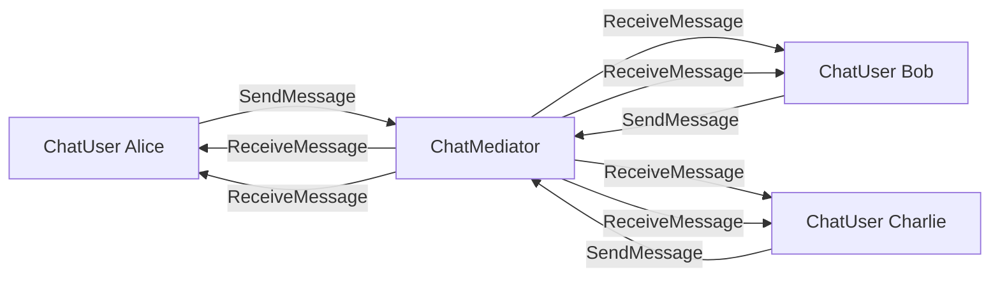
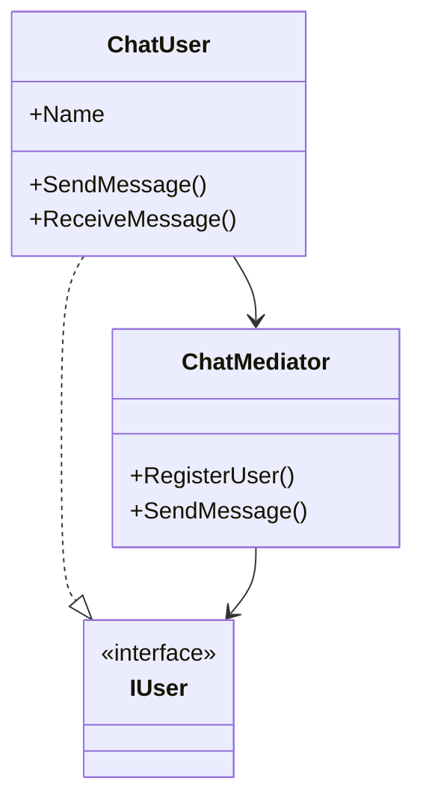

# Mediator Design Pattern

```mermaid
flowchart LR
    A[ChatUser Alice]
    B[ChatUser Bob]
    C[ChatUser Charlie]
    M[ChatMediator]

    A -->|SendMessage| M
    M -->|ReceiveMessage| B
    M -->|ReceiveMessage| C

    B -->|SendMessage| M
    M -->|ReceiveMessage| A
    M -->|ReceiveMessage| C

    C -->|SendMessage| M
    M -->|ReceiveMessage| A
    M -->|ReceiveMessage| B
```

```mermaid
 classDiagram
    class ChatMediator {
        +RegisterUser()
        +SendMessage()
    }

    class ChatUser {
        +Name
        +SendMessage()
        +ReceiveMessage()
    }

    class IUser {
        <<interface>>
    }

    ChatUser ..|> IUser
    ChatUser --> ChatMediator
    ChatMediator --> IUser
```
